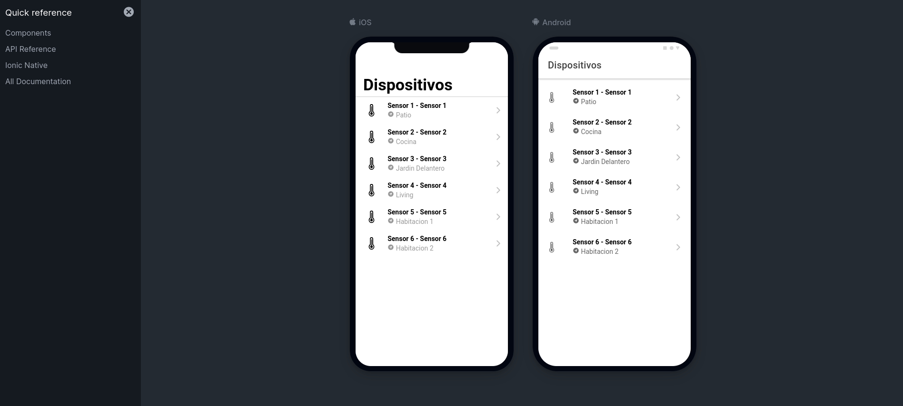
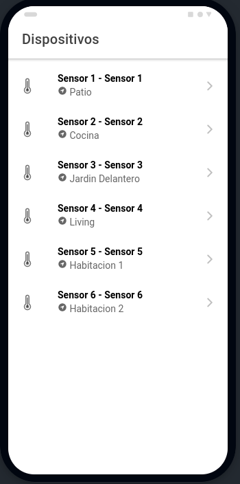
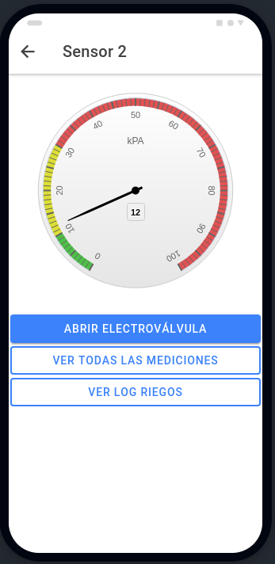
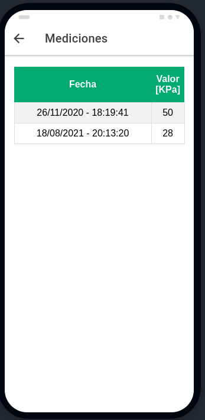
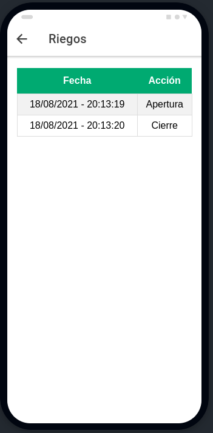

MIoT - DAM: Trabajo Final - Frontend
=======================

## Primeros pasos

### Instalar las dependencias

Para correr esté código es necesario contar con `Node.js`, `Angular` y `Ionic`.

`Node` se puede desccargar desde el siguiente [link](https://nodejs.org/es/).

Una vez instalado Node, también instala el manejador de paquetes `npm`. Mediante esta utilidad, se debe instalar `Angular` ejecutando el siguiente comando:

```
npm install -g @angular/cli 
```

Finalmente, para instalar Ionic, se procede de manera similar, usando este comando:

```
npm install -g @ionic/cli
```


### Descargar el código

Para descargar el código se debe ejecutar el siguiente comando:
```
git clone https://github.com/mmondani/MIoT_DAM_Proyecto_Ionic
```

### Ejecutar el código

Para correr el proyecto, ubicándose dentro de la carpeta raiz del mismo, ejecutar los siguientes comandos:

```
npm install
ionic serve --lab
```

Mediante estos comandos se van a descargar todas las dependencias del proyecto y se va a abrir una instancia de un browser para poder visualizar el proyecto de la misma forma que se haría en un equipo móvil.



## Detalles de implementación

El frontend fue implementado usando Ionic+Angular. El diseño fue pensado para ser visualizado en dispositivos móviles. 

Básicamente, la aplicación permite visualizar una lista de sensores de humedad. Cada sensor va a tener asociada una electroválvula la cual va a poder ser abierta o cerrada de la aplicación.

La primer pantalla permite ver el nombre que le fue asignado a cada sensor y su ubicación.



Dentro de un dispositivo, se podrá visualizar el valor actual que está midiendo. Además hay un botón que permite abrir o cerrar la electroválvula que tiene asociado el sensor.



Además, para cada dispositivo, se pueden consultar, no solo, todas las mediciones, sino tamibén un log de las operaciones de cierre y apertura de la electrovávula. 

Cada vez que la electroválvula se abra o se cierre se va a registrar esta operación. Además cada vez que se cierre, se va a actualizar el valor medido por el sensor, utilizando un número random entre 0 y 100.


